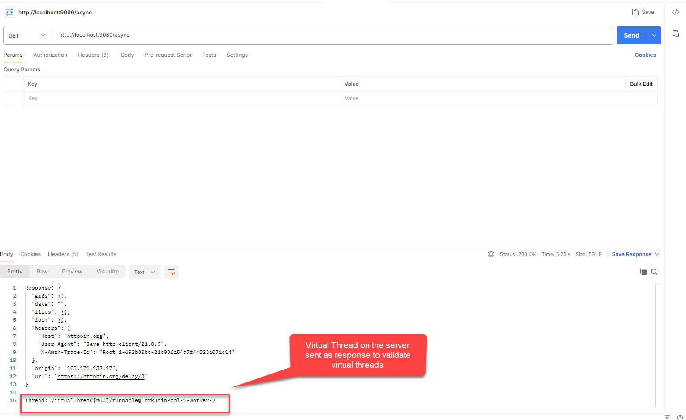

# Spring boot application enabled using Virtual Threads
## Blocking I/O calls like database, http client calls to remote rest services, file i/o, in REST APIs should use Virtual Threads
## Refer most important code snippet below



```
    @Async("virtualExecutor") <---------- This is the virtual thread bean reference (Executor that will execute using virtual threads)
    @GetMapping("/async")
    public CompletableFuture<String> asyncTask() {
        HttpClient httpClient = HttpClient.newHttpClient();

        return CompletableFuture.supplyAsync(() -> { // aysnc completatblefuture is not required, it is duplicate virtual thread
            try {
                HttpResponse<String> response = httpClient.send(
                        HttpRequest.newBuilder(URI.create("https://httpbin.org/delay/3"))
                                .GET()
                                .build(),
                        HttpResponse.BodyHandlers.ofString()
                );
                return "Response: " + response.body() +
                        "\nThread: " + Thread.currentThread(); // <---- this is another virtual thread 2
            } catch (Exception e) {
                throw new RuntimeException(e);
            }
        }, virtualExecutor);
    }
}


@Async("virtualExecutor")
@GetMapping("/async")
public CompletableFuture<String> externalPLMCloudAPI() {
    try {
        HttpResponse<String> response = httpClient.send(
            HttpRequest.newBuilder(URI.create("https://httpbin.org/delay/3"))
                    .GET()
                    .build(),
            HttpResponse.BodyHandlers.ofString()
        );
        return CompletableFuture.completedFuture(
            "Response: " + response.body() +
            "\nThread: " + Thread.currentThread()); //<----------Single virtual thread
    } catch (Exception e) {
        return CompletableFuture.failedFuture(e);
    }
}

@Configuration
@EnableAsync
public class VirtualThreadConfig {

    /**
     * Executor backed by virtual threads.
     * Spring will use this executor for any method annotated with @Async("virtualExecutor").
     */
    @Bean(name = "virtualExecutor") <----- This bean has to be referened in the REST API (/async)
    public Executor executor() {
        return Executors.newVirtualThreadPerTaskExecutor();
    }
}


| Use Case                               | Recommended? | Notes                                |
| -------------------------------------- | ------------ | ------------------------------------ |
| Blocking JDBC                          | ✅ Yes        | Perfect match                        |
| REST API calls (synchronous)           | ✅ Yes        | Helps concurrency                    |
| File I/O                               | ✅ Yes        | Uses OS-level blocking               |
| Messaging frameworks (Kafka)           | ⚠ Depends    | Works, but rarely needed             |
| CPU-heavy tasks (image processing, ML) | ❌ No         | Use platform threads or thread pools |

❗ Important Rule:

Virtual threads do not fix CPU bottlenecks — they fix thread contention caused by blocking.

🚀 Virtual Threads Change This

Virtual threads:

cost almost nothing to create

are scheduled by JVM—not the OS

unmount from physical threads when blocked

So when blocking happens, the virtual thread parks itself, and the underlying platform thread becomes free for another task.

➡️ That means you can have 100,000+ blocking tasks with no huge thread pools or tuning.

```
